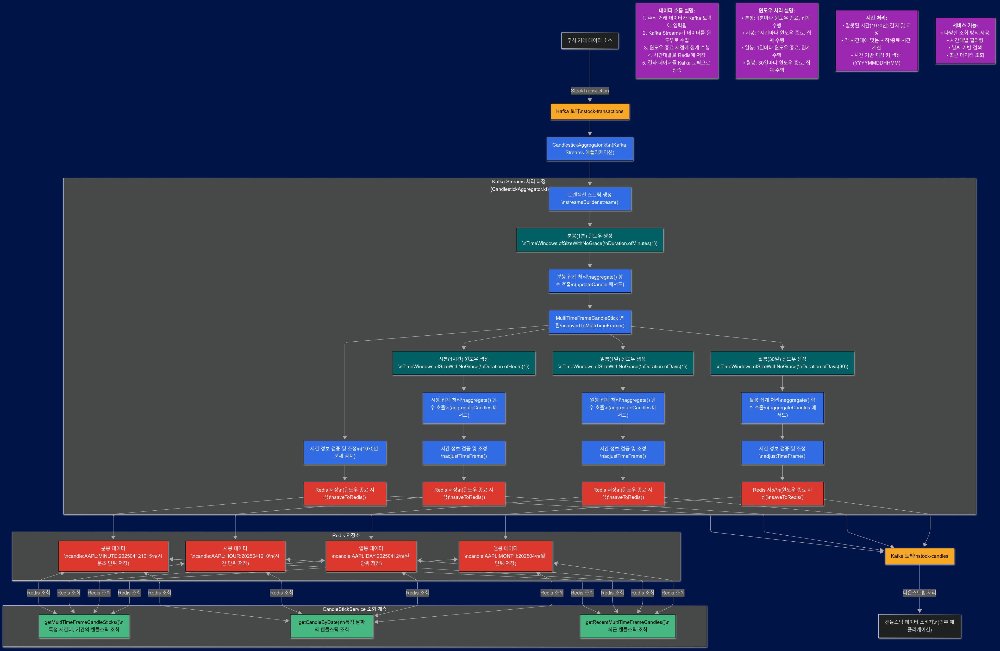

# 주식 차트 Kafka Streams 애플리케이션 (Stock Chart Kafka Streams Application)

Kafka Streams와 Redis를 활용하여 실시간으로 주식 거래 데이터를 처리하고 다양한 시간대(분봉, 시봉, 일봉, 월봉)의 캔들스틱 차트 데이터를 생성하는 애플리케이션입니다. 사용자가 쉽게 차트 데이터를 조회하고 분석할 수 있도록 체계적인 데이터 저장 구조를 제공합니다.

### Kafka Streams 관련 문서 정리
- [CandlestickAggrergation_정리.md](CandlestickAggrergation_%EC%A0%95%EB%A6%AC.md)
- [KafkaStreams_SpringBatch비교.md](KafkaStreams_SpringBatch%EB%B9%84%EA%B5%90.md)

## 🚀 주요 기능

- **실시간 데이터 처리**: Kafka Streams를 통한 지속적인 주식 거래 데이터 처리
- **다중 시간대 캔들스틱**: 동일한 거래 데이터로부터 분봉(1분), 시봉(1시간), 일봉(1일), 월봉(1개월) 데이터 동시 생성
- **체계적인 데이터 저장**: Redis에 시간대별로 구조화된 형태로 캔들스틱 데이터 저장
- **가독성 있는 키 구조**: 사람이 읽기 쉬운 형태(YYYYMMDDHHMM)의 Redis 키 구조 사용
- **유연한 조회 기능**: 다양한 시간대 및 기간별로 캔들스틱 데이터 조회 가능

## 🛠️ 기술 스택

- **Stream Processing**: Kafka, Kafka Streams
- **데이터 저장소**: Redis
- **Backend**: Spring Boot, Kotlin
- **직렬화**: Jackson, Spring Kafka JsonSerde
- **빌드 도구**: Gradle

## 💡 프로젝트 구현 과정에서의 고민점

### 1. 다중 시간대 처리 전략

다양한 시간대(분봉, 시봉, 일봉, 월봉)의 캔들스틱을 동시에 처리하기 위한 구조를 설계했습니다:

- **캐스케이딩 윈도우 처리**: 분봉 처리 스트림을 기반으로 상위 시간대(시봉, 일봉, 월봉) 윈도우 처리
- **독립적인 상태 관리**: 각 시간대별로 독립적인 상태 저장소를 사용하여 처리 로직 분리
- **데이터 흐름 최적화**: 분봉 스트림에서 파생된 다중 처리 구조로 중복 계산 방지

### 2. Redis 저장 구조 최적화

데이터 저장 및 조회의 효율성을 위해 Redis 키 구조를 최적화했습니다:

- **계층적 접근 설계**: `candle:{symbol}:{timeFrame}:{dateFormat}` 형태로 계층적 접근 가능
- **효율적인 조회 패턴**: 특정 심볼, 특정 시간대, 특정 날짜의 캔들스틱을 효율적으로 조회할 수 있는 구조

### 3. Kafka Streams 윈도우 처리 이해

Kafka Streams의 윈도우 처리 특성을 고려한 설계를 적용했습니다:

- **윈도우 종료 시점 이해**: 데이터는 윈도우 종료 시점에 집계되어 처리되는 특성 활용
- **로깅 전략**: 윈도우 처리 과정을 명확히 이해하기 위한 상세 로깅 구현
- **상태 관리**: 각 윈도우별 상태를 적절히 관리하여 시스템 안정성 확보

## ⚙️ 버전 및 실행 방법

### 사용 버전

- JDK 24
- Kotlin 1.9
- Spring Boot 3.4
- Kafka 3.4
- Redis 7.0

### 설치 단계

1. 환경 구성
```bash
# Docker Compose로 Kafka 및 Redis 실행
docker-compose up -d
```

2. 환경 변수 설정
```yml
# application.yml 파일 수정
spring.kafka.bootstrap-servers: localhost:9092
spring.data.redis.host: localhost
spring.data.redis.port: 6379
```

3. 애플리케이션 빌드 및 실행
```bash
./gradlew bootRun
```

## 📊 데이터 흐름도



```kotlin
.aggregate(
    { initializeMultiTimeFrameCandle(CandleTimeFrame.HOUR) }, 
    { key, minuteCandle, hourCandle -> aggregateCandles(key, minuteCandle, hourCandle) }, // 여기서 어플리케이션에 저장된 기존 값을 조회 후 Min, Max값을 업데이트
```


## 🌐 데이터 저장 구조

### Redis 키 패턴
```
candle:{symbol}:{timeFrame}:{dateFormat}
```

### 예시
- 분봉: `candle:AAPL:MINUTE:202504121015`
- 시봉: `candle:AAPL:HOUR:2025041210`
- 일봉: `candle:AAPL:DAY:20250412`
- 월봉: `candle:AAPL:MONTH:202504`

## 🔮 향후 개선 사항

- 시계열 DB를 활용한 데이터 장기 보관 정책 수립
- Kafka와 Redis 자원을 효율적으로 사용하고 있는지에 대한 고민 필요
- 데이터를 어떻게 하면 파티셔닝 등 효율적으로 오래 보관할수 있을지 고민 필요
- 성능 모니터링 및 대시보드 구성

---

이 프로젝트는 Kafka Streams와 Redis를 활용한 실시간 데이터 처리 시스템의 토이 프로젝트입니다. 대용량 트래픽 환경에서는 추가적인 최적화와 확장성 고려가 필요합니다.